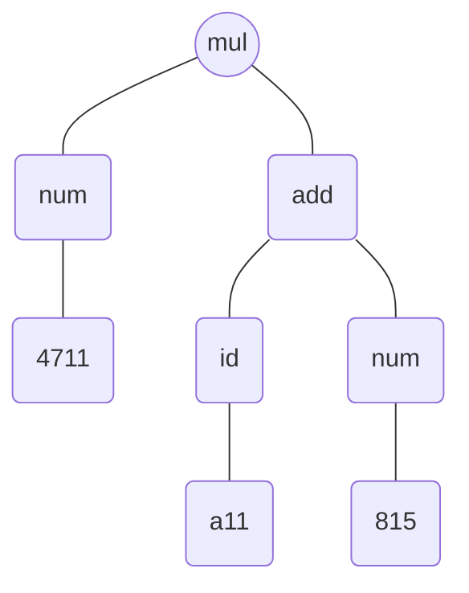

Den hierarchischen Aufbau von Programmen, die [abstrakte Syntax](Syntax.md#Abstrakte%20Syntax), beschreiben wir mit Baumsprache. 

## Beispiel
$$
\begin{align}
e \in Expr &::= num(\mathbb N)\\
&|indet(Ident)\\
&|add(Expr, Expr) \\
&|mul(Expr, Expr)
\end{align}
$$
```csharp
mul(num(4711), add(ident(a11), num(815)))
```

## Aufbau
$$\begin{align}
e \in Expr &::= num(\mathbb N)\\
&|indet(Ident)\\
&|add(Expr, Expr) \\
&|mul(Expr, Expr)
\end{align}$$
Die Definition führt drei verschiedene Dinge ein:
1. Einen namen für die Baumsprache: $Expr$,
2. Namen für die unterschiedlichen Knotenarten: $num, id, add$ und $mul$
3. Eine Metavariable für Elemente der Baumsprache: $e$

## Umgangsprachliche Lesart
Umgangssprachlich lässt sich die Definition wie folgt lesen: ein Element $e \in Expr$ ist entweder:
- Von der Form $num(n)$ mit $n\in \mathbb N$
- Von der Form $ident(x)$ mit $x \in Ident$
- Von der Form $add(e_1, e_2)$ mit $e_1, e_2 \in Expr$
- Von der Form $mul(e_1, e_2)$ mit $e_1, e_2 \in Expr$

## Formale Lesart
Formal ist die menge $Expr$ durch eine induktive Definition gegeben.

Die Menge $Expr$ ist die kleinste Menge mit den folgenden Eigenschaften:
1. Ist $n \in \mathbb N$, dann ist $num(n) \in Expr$
2. Ist $x \in Ident$, dann ist $ident(x) \in Expr$
3. Sind $e_1 \in Expr$ und $e_2 \in Expr$, dann ist auch $add(e_1, e_2) \in Expr$
4. Sind $e_1 \in Expr$ und $e_2 \in Expr$, dann ist auch $mul(e_1, e_2) \in Expr$
Wichtig ist, dass $Expr$ die kleinste Menge mit diesen Eigenschaften ist; nur Elemente, die sich auf eine der vier Arten bilden lassen, sind in $Expr$ enthalten.

## Notationelle Freiheiten
$$
\begin{align}
&n \in \mathbb N\\
&x \in Ident \\
&e\in Expr::=n\\
&\ \ \ \ \ \ \ \ \ \ \ \ \ \ \ \ |x\\
&\ \ \ \ \ \ \ \ \ \ \ \ \ \ \ \ | e_1+e_2\\
&\ \ \ \ \ \ \ \ \ \ \ \ \ \ \ \ | e_1 \cdot e_2
\end{align}
$$
