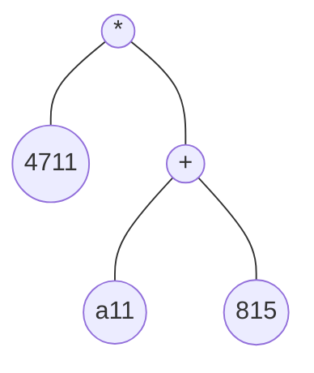

Der Syntax beschreibt die äußere Form von Programmen

## Lexikalische Syntax
Betrachten wir ein einfaches Beispielprogramm:
```csharp
4711* (a11 (* speed *) + 815)
```
Mikroskopisch gesehen besteht das Programm aus einer Folge von Zeichen:
- Der Ziffer 4
- Gefolgt von der Ziffer 7
- Gefolgt von der Ziffer 1
- Gefolgt von der Ziffer 1
- Gefolgt von einem Asteriskus *
- Gefolgt von einem Leerzeichen usw.


### Lexeme
In der lexikalischen Syntax einer Programmiersprache wird festgelegt, wie Zeichen zu größeren Einheiten, sogenannten Lexemen zusammengefasst werden.

## Kontextfreie Syntax
In der kontextfreien Syntax einer Programmiersprache wird festgelegt, welche Folgen von Lexemen gültige Programme sind und welche nicht.

Nicht alle Folgen von Lexemen stellen ein gültiges Programm dar:
```csharp
) * 4711 815 + ( a11
```
umfasst die gleichen [Lexeme](Syntax.md#Lexeme), ist aber kein Mini-F# Programm.

### Konkrete Syntax
Die [lexikalische Syntax](Syntax.md#Lexikalische%20Syntax) und die [kontextfreie Syntax](Syntax.md#Kontextfreie%20Syntax) bilden zusammen die konkrete Syntax einer Programmiersprache

### Abstrakte Syntax
Für das Studium von Programmiersprachen ist die hierarchische Struktur eines Programms relevant.


Die hierarchische Struktur verdeutlicht, dass sich der Ausdruck aus mehreren Teilausdrücken zusammensetzt. Man spricht auch von einem Rechenbaum oder allgemein von einem abstrakten Syntaxbaum.


