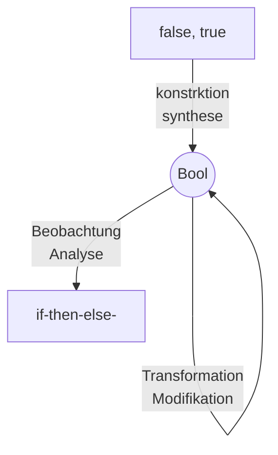

```mermaid
graph TD

START[ false, true ] -->|konstrktion<br>synthese| A((Bool))-->|Beobachtung<br>Analyse|STOP[if-then-else-]

A -->|Transformation<br>Modifikation| A
```

[not](Aussagen.md#Negation), [&&](Aussagen.md#Logisches%20Und(Konjunktion)), [||](AussEvaluatesagen.md#Logisches%20Oder(Disjunktion))