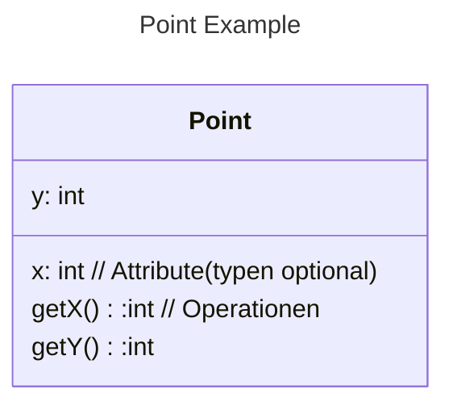
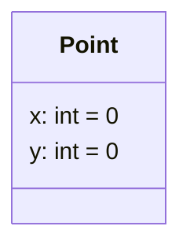
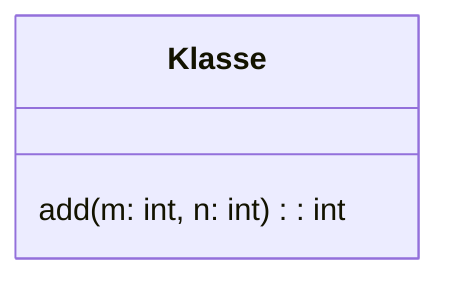
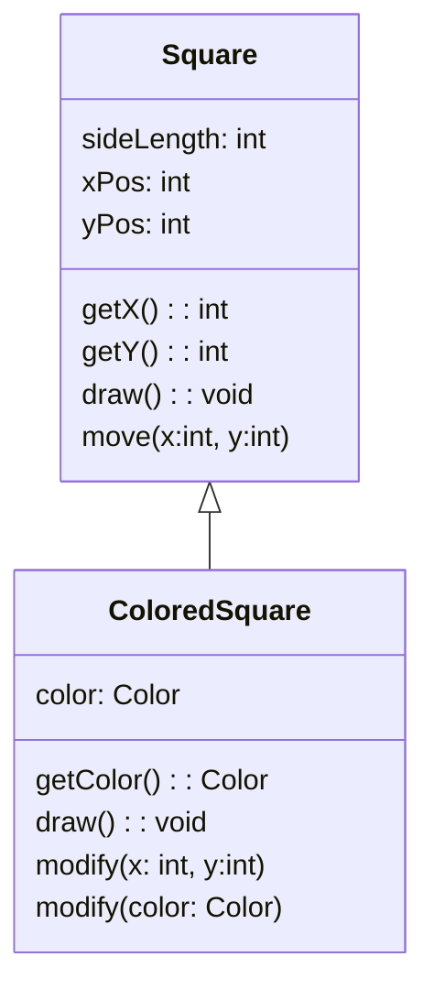
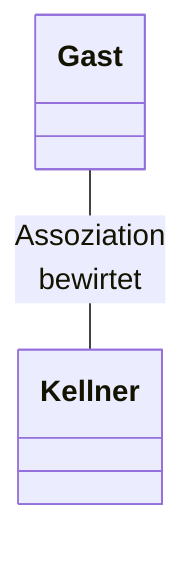
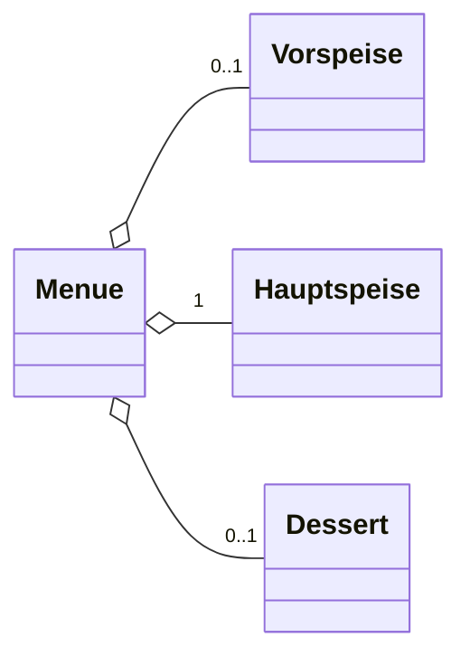
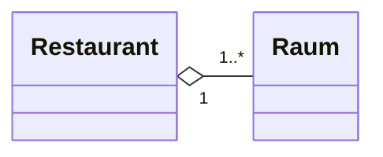

In einem Klassendiagramm werden die Eigenschaften einer abstrahierten Klasse dargestellt, dazu können Attribute, Methoden und Veerbungsrichtungen zählen. Auch die Sichtbarkeit dieser kann angegeben werden.

Starten wir mit einem zweidimensionalen Punkt:




Die Attribute nennen wir __Instanzattribute__, sie gehoeren zu der Instanz einer Klasse, nicht der Klasse selbst.

## Sichtbarkeiten
Die Sichtbarkeit kann mit einem Modifikator angegeben werden:

- $+$ -> Oeffentlich sichtbar
- $-$ -> Privat
- $\#$ -> Protected(nur fuer die Klasse und Kindklassen sichtbar)
- $\sim$ -> Package, nicht in allen Programmiersprachen verfuegbar

Der Standardmodifikator für Attribute in Java ist Package.


|             | Innerhalb der Klasse | Innerhalb des Pakets | In Unterklassen<br>(selbes Paket) | in Unterklassen<br>(andere Pakete) | global |
| ----------- | -------------------- | -------------------- | ----------------------------- | ------------------------------ | ------ |
| öffentlich |     $\checkmark$                 |      $\checkmark$                |         $\checkmark$                      |           $\checkmark$                     |     $\checkmark$   |
| geschützt  |       $\checkmark$               |      $\checkmark$                |              $\checkmark$                 |            $\checkmark$                    |        |
| package     |      $\checkmark$                |      $\checkmark$                |     $\checkmark$                          |                                |        |
| privat      |        $\checkmark$              |                      |                               |                                |        |


## Vorgabewerte

Attribute haben im Allgemeinen Typen, manchmal auch Vorgabewerte(Initialwerte)



## Mehrstellige Operationen



## Generalisierung und Spezialisierung




- Die Klasse ColoredSquare Spezialisiert die Klass Square
- Umgekehrt generalisiert Square die Klasse ColoredSquare
- In dieser Situation nennt man Square Superklasse und ColoredSquare Subklasse.

Da die Subklase die Attribute, Operationen und Assoziationen der Superklasse erbt, spricht man auch von Vererbung.

- Die Operation $draw$ in ColoredSquare ueberschreibt die Operation $draw$ der Square Klasse und Implementiert diese neu.

- Die Operation $modify$ in der ColoredSquare Klasse wird überladen, welche der beiden Operationen ausgeführt wird hängt von der [Signatur](Grundlagen%20der%20Programmierung/Signatur.md) der Argumente ab.

Beim überschreiben von Operatioen ist es auch erlaubt ihre Sichtbarkeit zu ändern. 
Theoretisch lässt sich beim überschreiben auch der Name ändern, Damit der Bezug klar bleibt, kann er explizit im Diagramm angegeben werden.

Beim Überladen darf man nicht nur die Argumentensignatur sondern auch die Rueckgabetypen ändern.

## Assoziation

Eine Assoziation zwischen zwei Klassen liegt vor, wenn es eine [semantische](Semantik.md) Beziehung zwischen ihnen gibt



Es kann eine __Leserichtung__ f"ur die Assoziationen eingef"ugt werden.

Die __Navigationsrichtung__ beschrieben durch eine Pfeilspitze kann von der Leserichtung abweichen. Sie beschreibt welche Klasse ihren Assoziationspartner kennt.

Multiplizitaeten/Kardinalit"aten an beiden Enden der Assoziationen k"onnen Multiplizitaeten in Form von Intervallen $m..n$ oder einfach nur $m$ f"ur $m..m$ angegeben werden.

Entspricht eienr Liste in Java


Klassen k"onnen in verschiedenen Assoziationen verschiedene Rollen einnehmen. Die Rollennamen k"onnen an den Assoziationen notiert werden.


## Aggregation

Eine __Aggregation__ zwischen den Klassen _A_ und _B_ liegt vor, wenn Instanazen der Klasse _A_ Instanzen von _B_ als Teile enthalten.

Ein Ganzes enth"alt ein oder mehrere Teile

In Java:
```java
public class Menue{

	@Nullable
	private Vorspeise vorspeise;
	@Nullable
	private Dessert dessert;
	@NotNull
	private Hauptspeise hauptspeise;
}
```

In Java kann zwischen Komposition und Aggregation nicht unterschieden werden.



Das Menue enthae;t optional eine Vorspeise, genau eine Hauptspeise und ein optionales Dessert.
Die Teile koennen auch ohne das Ganze existieren.

## Komposition

Eine Komposition zwischen den Klassen _A_ und _B_ liegt vor, wenn Instanzen der Klasse _A_ Instanzen von _B_ als Teile enthalten und die Lebenszeit der Teile vom Ganzen kontrolliert wird. Das heißt die Teile(Instanzen von _B_) werden gelöscht, sobald die Instanz von _A_ gelöscht wird.



Ein Restaurant besteht aus mehreren Räumen. Die Teile(Räume) koennen nicht ohne das ganze Restaurant existieren.

Wird das Restaurant zerstört, so werden auch seine Räume zerstört.

---

Neben binären zweistelligen Assoziationen gibt es auch n-aere Assoziationen die eine Beziehung zwischen $n$ Klassen beschreiben


---

Klassen können in unterschiedlicher Weise spezialisiert bzw. unterteilt werden. Daher können Generalisierungen zu Gruppen zusammengefasst werden. Dabei wird die jeweilige __Generalisierungsgruppe__ im Diagramm mit angegeben.

Die __Generalissierungsgruppen__ koennen Eigenschaften zugeordnet werden.

- complete / incomplete
	- complete Die Generalisiserungsgruppe ist vollstaendig, d.h. sie ueberdeckt alle Instanzen der Klasse
	- incomplete Die Generalisierungsgruppe ist unvollstaendig
- disjoint / overlapping
	- disjoint die spezialsierenden Klassen besitzen keine gemeinsamen Instanzen
	- overlapping die spezialisierende Klassen koennen gemeinsame Instanzen besitzen
 


Hier handelt es sich um eine Partitionierung der Instanzen der Klasse

---


Es fehlt eine Klasse Jugendlicher

---


Schildkroeten sind sowohl Land als auch Meerestiere

---


Fliegende Tiere fehlen.

## Mehrfachvererbung

Es ist auch moeglich, dass eine Klasse von mehreren Klassen erbt, d.h eine Spezialisierung verschiedener Klassen ist. Dies bezeichnet man als __Mehrfachvererbung__


---

Basierend auf dieser grafischen Notation sollte man objektorientierte Systeme zunaechst modellieren, bevor sie implementiert werden. Dabei stellen sich insbesondere folgende Fragen

- Welche Objekte und Klassen werden benoetigt?
- Welche Merkmale haben diese Klassen und welche Beziehungen bestehen zwischen ihnen?
- Wie sollen die Klassen eingesetzt werden?
- Welche Operatione stellen diese Klassen zur Verfuegung? Wie wirken die Operationen zusammen?
- In welchen Zustaenden koennen sich Objekte befinden und welche Nachrichten werden wann an andere Objekte geschickt?

---

## Abstrakte Klassen

Eine Klasse heisst abstrakt, wenn sie selbst keine Instanzen haben kann. Dazu wird die Eigenschaft $\lbrace abstract\rbrace$ unter dem Klassennamen angegeben.
Alternativ kann der Klassenname *kursiv* geschrieben werden.


## Interfaces

Interfaces dienen zur Definition von abstrakten Eigenschaften, ohne eine Implementierung anzugeben(z.B etwas ist sortierbar). Dazu wird die $<<interface>>$ über den Klassennamen geschrieben.


## Polymorphismus

Polymorphismus ermöglicht es, den gleichen Namen für gleichartige Operationen zu verwenden, die auf Objekten verschiedener Klassen auszuführen sind.

Der Sender muss nur wissen, dass eine Empfängerobjekt das gewünschte Verhalten besitzt.

Er muss nicht wissen, zu welcher Klasse das Objekte gehört.

Dieser Mechanismus ermöglicht es, flexible und leicht änderbare Software-Systeme zu entwickeln.


## Dynamisches Binden

Erst zur Laufzeit wird bestimmt ob eine Referenz auf das Objekt _A_ oder _B_ zeigt. Polymorphismus und spaetes Binden sind untrennbar verbunden, wenn zur uebersetzungszeit die Klasse des Objekts nicht bekannt ist, dann kann nicht bestimmt werden, welche Methode ausgefhuert wird.
Beim spaeten Binden wird deshalb die Methode erst zur Ausfuehrungszeit an ein bestimmtes Objekt gebunden.

## Parametrisierte Klassen

Parametrisiserte Klassen beschreibt eine Familie von Klassen mit einem oder mehreren formalen Paramtern, Parameter einer generischen Klasse sind
- Typ-Parameter
- Konstanten-Parameter (in UML erlaubt in Java nicht moeglich)


```Java

public class DatenKnoten<T>{

	private T element;
	...

	public void setElement(T element){
		this.element = element;
	}
	...
}
```

In Java sind ausschließlich Typ-Parameter erlaubt