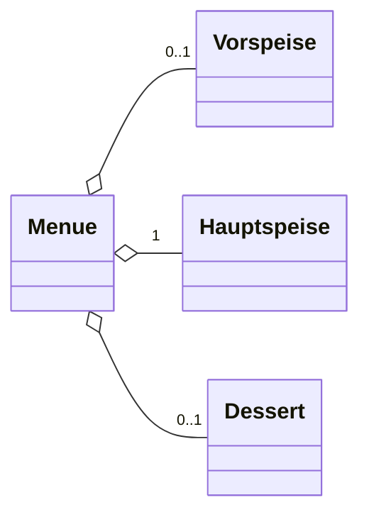

Eine __Aggregation__ zwischen den Klassen _A_ und _B_ liegt vor, wenn Instanazen der Klasse _A_ Instanzen von _B_ als Teile enthalten.

Ein Ganzes enth"alt ein oder mehrere Teile

In Java:
```java
public class Menue{

	@Nullable
	private Vorspeise vorspeise;
	@Nullable
	private Dessert dessert;
	@NotNull
	private Hauptspeise hauptspeise;
}
```

In Java kann zwischen Komposition und Aggregation nicht unterschieden werden.



Das Menue enthae;t optional eine Vorspeise, genau eine Hauptspeise und ein optionales Dessert.
Die Teile koennen auch ohne das Ganze existieren.