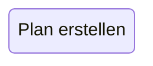
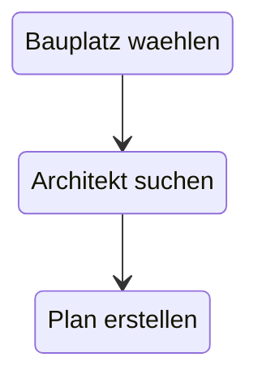
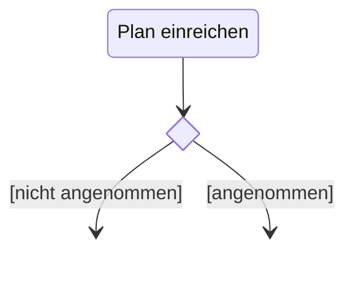
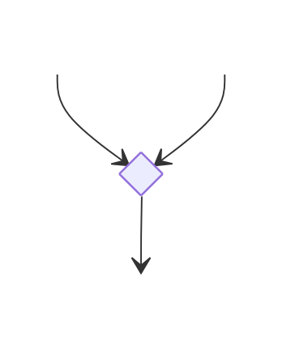
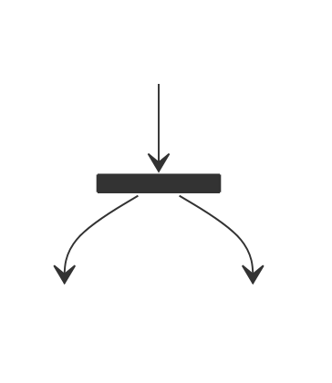
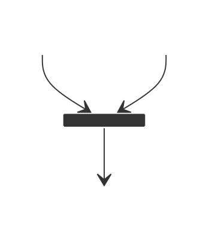
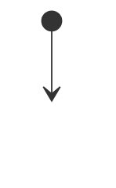
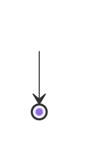
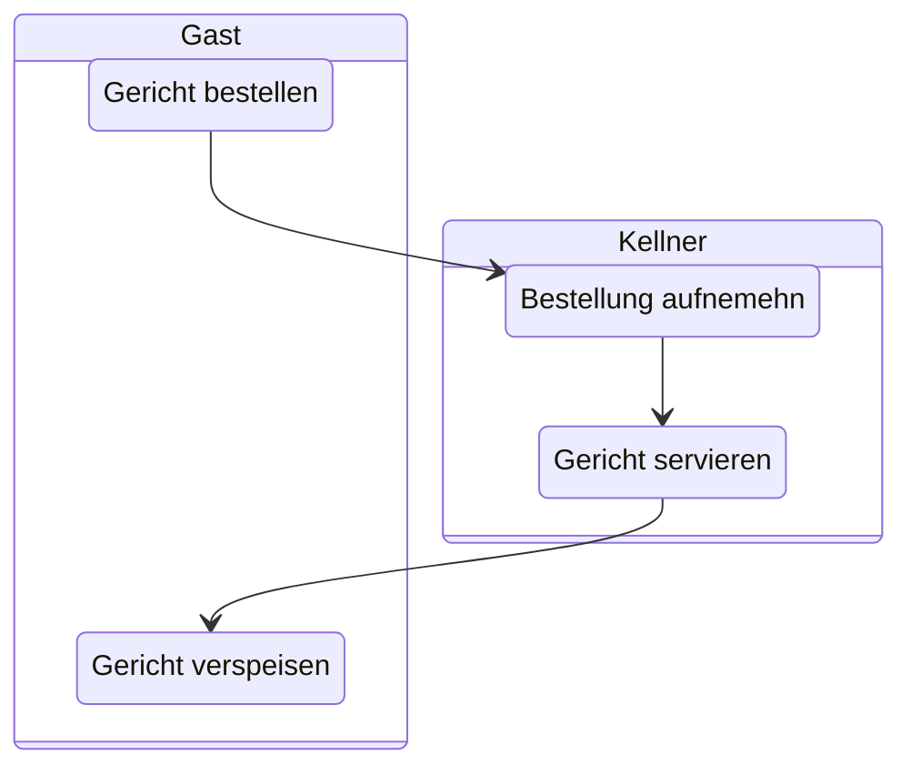

Aktivitätsdiagramme sind UML Diagramme, mit denen Ablaufpläne, Reihenfolgen von Aktivitäten, parallele Aktivitäten, und co. modellieren kann.

Sie werden verwendet, um Geschäftsprozesse des Auftraggebers zu modellieren. Sie können aber auch dafür eingesetzt werden um interne Systemprozesse zu beschreiben.

## Aktionen

Eine __Aktion__ wird im Aktivitaetsdiagramm durch ein Rechteck mit abgerundeten Ecken dargestellt.

## Kontrollfluss

Als __Kontrollfluss__ werden die Kanten zwischen Aktionen bezeichnet.

## Signale

__Signale__ werden vom Sender erzeugt und vom Empfänger empfangen. Signale können Daten enthalten.

## Objektknoten

__Objektknoten__ beschreiben Speicher für die Übergabe von Objekten bzw. Ressourcen.

## Verzweigungs und Verbindungsknoten

__Verzweigungsknoten__ beschreiben eine Verzweigung des Kontrollflusses, wobei aus den möglichen Kontrollflüssen genau einer ausgewählt wird.

Die Ueberwachungsbedingungen, auch genannt guard, die den Kontrollfluss steuern, werden in eckigen Klammern an den ausgehenden Kontrollflüssen notier.

---

__Verbindungsknoten__ führen mehrere alternative Kontrollflüsse zusammen.

Es gibt auch Knoten, die sowohl Verzweigungs- als auch Verbindungsknoten sind, d.h mehrere eingehende und mehrere ausgehende Kontrollflüsse haben.

## Gabelungen

Eine __Gabelung__, teilt einen Kontrollfluss in mehrere parallele Kontrollflüsse auf.

## Vereinigungen

Analog zu [Gabelungen](Aktivitätsdiagramme.md#Gabelungen) gibt es die __Vereinigung__, die mehrere parallele Kontrollflüsse zusammenfasst.

---

> Kontrollflüsse dürfen nur an [Objektknoten](#Objektknoten), [Entscheidungsknoten](#Entscheidungsknoten), [Gabelungen](#Gabelungen) aufgespalten
> und an [Objektknoten](#Objektknoten), [Verbindungsknoten](#Verzweigungs%20und%20Verbindungsknoten) und [Vereinigungen](#Vereinigungen) wieder zusammengeführt werden.

## Start und Endknoten

Ein __Startknoten__ modelliert den Beginn eines Kontrollflusses. Ein Aktivitätsdiagramm, kann mehrere Startknoten haben, die dann mehrerer parallel laufende Kontrollflüsse starten(entspricht einem Startknoten gefolgt von einer Gabelung). In einen Startknoten dürfen keine Kontrollflüsse hineinführen.

---

Das __Aktivitätsende__ signalisiert, dass die Aktivität, also sämtliche Kontrollflüsse, beendet werden.

Es gibt auch ein Symbol für das __Flussende__, das nur den eingehenden Kontrollfluss beendet. Die restliche Aktivität, also andere Kontrollflüsse, laufen weiter.

Beide dieser Elemente dürfen mehrfach in einem Diagramm vorkommen.

## Aktivitätsbereiche

__Aktivitätsbereiche__ fassen mehrere Knoten(Aktionen, Objektknoten, etc.) zu einer Einheit zusammen. Das dient allgemein dazu, um die Verantwortung für bestimmte Aktionen festzulegen.

## Parameter und Parametersätze 

__Parametersaetze__ legen fest, dass an allen __Pins__ Daten anliegen müssen, um die Verarbeitung durchführen zu können.

## Unterbrechungsbereiche

Der __Unterbrechungsbereich__ wird genau dann verlassen, wenn die Unterbrechung auftritt. Alle Aktionen im Unterbrechungsbereich werden beendet. Die Verarbeitung wird mit dem Zielknoten der Unterbrechungskante fortgesetzt.

## Mengenverarbeitungsbereich

In __Mengenverarbeitungsbereichen__ werden Sammlungen (z.B. Felder oder Kollektionen) in ihre einzelnen Elemente aufgelöst. Diese werden anschließend einzeln verarbeitet und nach der Verarbeitung wieder zur Sammlung zusammengesetzt.

## Schleifenknoten

__Schleifenknoten__ dienen zur wiederholten Ausführung von Schritten. Der for-Bereich dient der Initialisierung. Der while-Bereich entscheidet, ob der do-Bereich ausgeführt wird. Der while-Bereich kann entfallen(stets "true" -> Endlosschleife). Dann Abbruch durch Unterbrechungskante.

## Entscheidungsknoten

---

