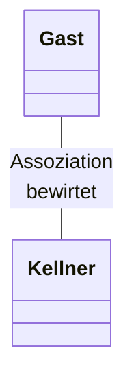

Eine Assoziation zwischen zwei Klassen liegt vor, wenn es eine [semantische](Semantik.md) Beziehung zwischen ihnen gibt

Es kann eine __Leserichtung__ f"ur die Assoziationen eingef"ugt werden.

Die __Navigationsrichtung__ beschrieben durch eine Pfeilspitze kann von der Leserichtung abweichen. Sie beschreibt welche Klasse ihren Assoziationspartner kennt.

Multiplizitaeten/Kardinalit"aten an beiden Enden der Assoziationen k"onnen Multiplizitaeten in Form von Intervallen $m..n$ oder einfach nur $m$ f"ur $m..m$ angegeben werden.

Entspricht eienr Liste in Java

Klassen k"onnen in verschiedenen Assoziationen verschiedene Rollen einnehmen. Die Rollennamen k"onnen an den Assoziationen notiert werden.

---

Neben binären zweistelligen Assoziationen gibt es auch n-aere Assoziationen die eine Beziehung zwischen $n$ Klassen beschreiben

