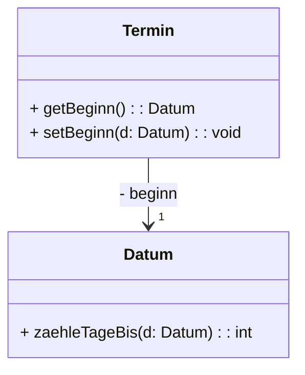
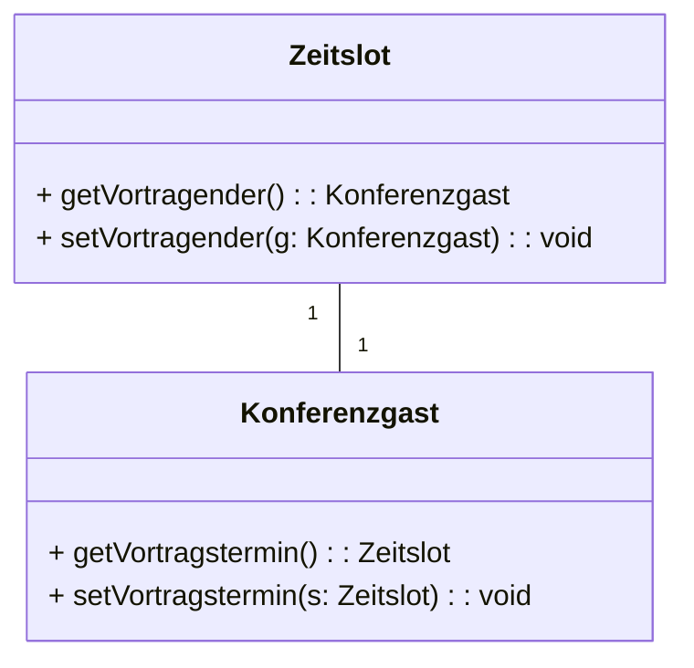

## Gerichtete Assoziationen



```java
public class Termin{
	private Datum beginn;
	...
}
```

Unvollständig initialisierte Objekte führen zu Problemen:

```Java
Termin t2 = new Termin();
Datum heute = new Datum;

int restzeit = heute.zaehleTageBis(t2.getBeginn());
```

Wirft eine `NullPointerException` um dies zu verhindern verwendet man sogenannte __Konstruktoren__

```Java
public class Termin{
	private Datum beginn;

	public Termin(Datum beginn){
		this.beginn = beginn;
	}
	...
}

```

Konstruktor aufrufe mit `null` sollten hier verboten sein. Die übergebenen Argumente sollten daher im Konstruktor ueberprueft werden.

---

Die Instanziierung von unvollständig initialisierten Objekten durch den Benutzer sollte möglichst unterbunden werden.

Dies ist bei gerichteten Assoziationen unproblematisch:

Zuerst erzeugen wir ein Objekt der Klasse _B_ und uebergeben eine Referenz als Argument an den Konstruktor von Klasse _A_.

Falls `null` nicht erlaubt ist sollte dies im Konstruktor ueberprueft werden.

## Ungerichtete Assoziationen



```Java
public class Zeitslot {
	private Konferenzgast vortragender;

	public Konferenzgast getVortragender(){
		return vortragender
	}

	public void setVortragender(Konferenzgast g){
		this.vortragender = g;
	}

}

public class Konferenzgast{
	private Zeitslot vortragstermin

	public Zeitslot getVortragstermin(){
		return vortragstermin
	}

	public void setVortragstermin(Zeitslot s){
		this.vortragstermin = s;
	}
}
```

Bei der Initialisierung durch Setter aufrufe kommt es zuerst zwar nicht zu Problemen, aber wie wir bereits besprochen haben sind diese Fehleranfällig und die Korrekte Initialisierung ist dem Programmierer überlassen.

```Java
Zeitslot s = new Zeitslot();
Konferenzgast g = new Konferenzgast();
s.setVortragender(g);
g.setVortragstermin(s);
```

Die Initialisierung ist nicht möglich da wir eine Zyklische Abhängigkeit haben:

```Java
Zeitslot s = new Zeitslot(new Konferenzgast(...))
```


Die Lösung hierfür sind sogenannte __Factory-Methoden__

```Java
public class Konferenzgast{
	private Zeitslot vortragstermin;

	private Konverenzgast(){}

	public static Konferenzgast
		erzeugeKonferenzgastMitZeitslot(){
			Konferenzgast g = new Konferenzgast();
			g.vortragstermin = new Zeitslot(g);
			return g;
		}
	public Zeitslot getVortragstermin(){
		return vortragstermin
	}
}
```

Statt dem Konstruktor wird eine statische Methode für die Instanziierung von Objekten bereitgestellt.
Die Methode uebernimmt die Initialisierung der Objekte mithilfe von settern. Der Konstruktor kann nicht mehr verwendet werden indem wir ihn auf `private` stellen. Der Programmierer kann nun nur vollständig initialisierte Objekte durch die Factory-Methode instanziieren.


## Verschiedene Assoziationstypen

Java lässt üblicherweise keine Rueckschluesse auf den Assoziationstyp zu, da es in Java einen sogenannten Garbage Collection gibt der die Lebensdauer von Objekten beeinflusst, der Programmierer hat keinen direkten Einfluss auf die Lebensdauer mehr.