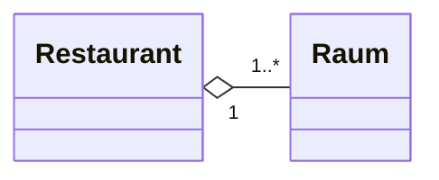

Siehe auch: [Komposition](Mathe/Komposition.md)

Eine Komposition zwischen den Klassen _A_ und _B_ liegt vor, wenn Instanzen der Klasse _A_ Instanzen von _B_ als Teile enthalten und die Lebenszeit der Teile vom Ganzen kontrolliert wird. Das heißt die Teile(Instanzen von _B_) werden gelöscht, sobald die Instanz von _A_ gelöscht wird.

Ein Restaurant besteht aus mehreren Räumen. Die Teile(Räume) koennen nicht ohne das ganze Restaurant existieren.

Wird das Restaurant zerstört, so werden auch seine Räume zerstört.