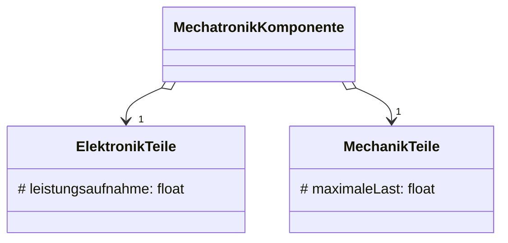

In Java ist die Mehrfachvererbung nicht moeglich.
Anstatt von Mehrfachvererbung gibt es folgende Loesungen:

### [Aggregation](Aggregation.md) statt Vererbung



```Java
public class MechatronikKomponente{
	private final ElektronikTeile elektronikTeile;
	private final MechanikTeile mechanikTeile;

	public MechatronikKomponente(){
		elektronikTeile = new ElektronikTeile();
		mechanikTeile = new MechanikTeile();
	}
}
```

## Interfaces

Statt der Vererbung von Klassen werden mehrere Schnittstellen implementiert.
Instanzattribute können auf diese Weise nicht vererbt werden.


## Probleme mit Mehrfachvererbung
Mehrfachvererbung kann zu Problemen führen, wenn von mehreren Klassen geerbt wird, die in der Subklasse sichtbare, gleichnamige Attribute oder Methoden besitzen.

