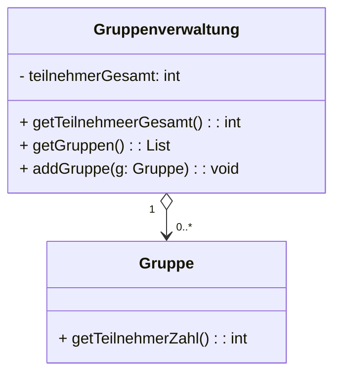

```Java
public class Gruppenverwaltung{
	private List<Gruppe> gruppen = new ArrayList<>();
	private int teilnehmerGesamt;

	public void addGruppe(Gruppe g){
		gruppen.add(g);
		teilnehmerGesamt += g.getTeilnehmerZahl();
	}

	public int getTeilnehmerGesamt(){
		return teilnehmerGesamt;
	}

	public List<Gruppe> getGruppen(){
		return gruppen;
	}

}
```

Ein Illegaler Zugriff würde folgendermaßen aussehen:

```Java
Gruppe g = new Gruppe("Pierre", "Laura");
Gruppenverwaltung v = new Gruppenverwaltung();

List<Gruppe> gruppen = v.getGruppen();
gruppen.add(g);

System.out.println(v.getTeilnehemerGesamt());
// Gibt 0 aus
```

Durch das herausgeben der Referenz auf das Attribute `gruppen` durch den getter `getGruppen` ist ein schreibender Zugriff möglich.

## Lösungen

### Zusatzmethoden

Wir geben die Referenz auf das Attribute nicht durch einen Getter heraus, dafür bieten wir Extraoperationen an um das Attribut zu manipulieren.

Dieser Ansatz bietet die Groesstmoegliche Kontrolle, allerdings müssen wir eventuell viele Zusatzmethoden Implementieren und wir erhalten einen Zusatzaufwand beim Iterieren über Listenelemente.

## Iteratoren

Anstatt eine Referenz auf die Liste herauszugeben verwenden wir einen Iterator, dieser verhindert zwar das einfügen, nicht jedoch das löschen von Elementen.


### Read-Only Wrapper

Wir geben einen Wrapper um die Referenz heraus die das Lesen oder Schreiben auf die Liste verhindert, allerdings ist es nur durch Dokumentation möglich anzuzeigen das wir einen Solchen Wrapper verwenden, dadurch kann es zu Runtime Exceptions kommen.

### Defensive Kopien

Wir geben eine Kopie der Liste heraus und nicht die Liste selber, dadurch ist die Modifikation der ursprünglichen Liste unmöglich, die Liste wird aber nicht aktuell gehalten und wir erhalten einen Extraaufwand durch das kopieren der Liste.
