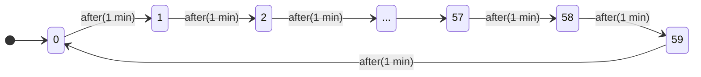
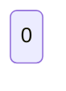
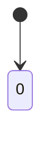
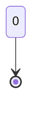
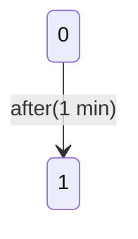

Zustandsdiagramme, werden verwendet, wenn bei der Modellierung der Fokus auf die __Zustaende__ und Zustandsuebergaenge des Systems gelegt werden soll.

Im Gegensatz zu Aktivitaetsdiagrammen werden weniger die Aktionen des Systems, sonder vielmehr die Reaktionen des Systems auf die Umgebung beschrieben.

Wir lernen Zustandsdiagramme am Beispiel der Modellierung einer Armbanduhr kennen.

Die Armbanduhr hat zwei Knoepfe (a, b) und zwei Modi(Zeitanzeige, Alarmeinstellung). Zwischen diesen Modi wechselt man mit Hilfe von Knopf a.

Der Alarm kann aus oder an sein. Man kann zwischen den Alarmzustaenden mit Hilfe von Knopf b wechseln.

Wir beginnen zunächst mit der Modellierung der Minutenanzeige.

Ein __Zustand__ eines Zustandsdiagramms wird durch ein Rechteck mit abgerundeten Ecken dargestellt.

Ein __Startzustand__ wird durch einen schwarzen ausgefüllten Kreis gekennzeichnet.

__Endzustaende__ werden wie das Aktivitaetsende in [Aktivitätsdiagrammen](Aktivitätsdiagramme.md) durch einen umrandeten schwarzen Kreis gekennzeichnet.

Eine __Transition__ ist ein Pfeil, der mit Ereignis [Bedingung] / Effekt beschriftet ist (alle drei optional)

__Ereignis__: Signal oder Nachricht welche die entsprechende Transition auslöst

__Bedingung__: Ueberwachungsbedingung(auch Guard genannt)

__Effekt__: Effekt, der durch die Transition ausgelöst wird

Im obigen Beispiel(Minutenanzeige) gibt es nur Ereignisse(sogenannte time events), die die Zeitspanne spezifizieren, nach der die Transition ausgeloest wird. Es gibt auch andere Ereignisse, z.B den Empfang von Botschaften.

Neben den Effekten, die durch Transition ausgeloest werden, koennen in einem Zustand weitere Aktionen bei Eintritt, Verweilen oder Verlassen ausgeloest werden.

Sie haben den gleichen Aufbau wie die Beschriftung einer Transition: Ereignis [Bedingung] /  Effekt. Dabei kann ein Ereignus unter anderem Folgendes sein:

- entry: Der entsprechende Effekt wird beim Eintritt in den Zustand ausgeloest.
- do: der Effekt ist eine Aktion, die nach dem Betreten des Zustands ausgefuehrt wird und spaetestens dann endet, wenn der Zustand wieder verlassen wird.
- exit: Der entsprechende Effekt wird beim Verlassen des Zustands ausgeloest.

Beispiel: Die Uhr soll zu jeder Vollen Stunde ein Signal von sich geben. Daher wird die Aktion beep beim Eintritt in den Zustand 0 ausgelöst.

Die Stundenanzeige soll parallel zur Minutenanzeige laufen, d.h., die Uhr ist in zwei Zustände gleichzeitig(ein Zustand für die Stunden, der andere für die Minuten). Diese Situation wird durch Regionen modelliert.

__Regionen__ unterteilen ein Zustandsdiagramm in Bereiche, die parallel zueinander ausgeführt werden.

Es gibt jetzt zwei Startzustände, die beide zu Beginn betreten werden. Da Stunden und Minutenanzeigen nicht unabhängig voneinander arbeiten, ist eine Synchronisation eingebaut. Die Transition in den Minutenzustand 0 löst einen Effekt h aus. Dieser Effekt ist ein Trigger, der das entsprechende Ereignis auslöst und den Uebergang in den nächsten Stunden zustand verursacht. Die beiden Transitionen werden synchronisiert und finden gleichzeitig statt.

Transitionen verbrauchen im Allgemeinen keine Zeit(im Gegensatz zum Aufenthalt in Zustaenden).
Neben Triggern, die direkt ausgefuehrt werden, gibt es auch Events, die zunaechst in einer Event Queue abgelegt werden. Diese Warteschlange wird schrittweise abgearbeitet, wobei die entsprechenden Ereignisse ausgeloest werden. Damit kann asynchrone Kommunikation beschrieben werden. Effekte koennen direkte Kommunikation bedeuten, koennen aber auch sogenannte Broadcasts sein. Diese sind ueberall im Zustandsdiagramm sichtbar.

Nun soll noch die Möglichkeit hinzugefügt werden, das Alarmsignal zu vollen Stunden aus- und wieder einzuschalten. Dazu führen wir weitere Zustände Alarm on, off ein, in die man durch Drücken von $a$ gelangt.
Dazu bräuchten wir sehr viele(mindestens 84) mit $a$ beschriftete Transitionen, die aus den Stunden/Minutenzustaenden ausgehen.
Dafür gibt es __Zusammengesetzte Zustände__, diese dienen dazu, um Hierachiene von Zuständen zu modellieren und damit ein, und ausgehende Transitionen zusammenzufassen.

Bei dieser Modellierung ergeben sich jedoch folgende Probleme:

Beim Betaetigen von $a$ wird der Alarm stets in den on-Zustand versetzt. Man moechte aber vielleicht lieber im zuletzt dort eingestellten Zustand starten.

Beim Wechsel vom Alarm-Stellmodus in den Normalmodus wuerde die Uhr bei 00:00 neu gestartet werden.

Ausserdem wir im off-Zustand das Beep beim Eintritt in den Zustand 0 der Minuten Region noch unterdrueckt werden.

Deshalb gibt es verschiedene Eintritts- und Austrittsmoeglichkeiten.

## Eintrittsmoeglichkeiten

Beim Standard-Eintritt wird der Startzustand des zusammengesetzten Zustands angesprungen.

Beim Expliziten Eintritt wird bei dem explizit angegebenen Folgezustand fortgesetzt.

Beim Eintritt ueber die flache Historie wird falls der zusammengesetzte Zustand bereits frueher besucht wurde, der letzte vor dem Verlassen aktive Unterzustand der obersten Ebene wieder betreten. Falls der Zustand noch nie betreten wurde, so wird der Zustand betreten, auf den die vom H-Knoten ausgehende Kante verweist.

Der Eintritt ueber die tiefe Historie bewirkt das falls der zusammengesetzte Zustand bereits frueher besucht wurde, der letzte vor dem Verlassen, aktive Unterzustand der tiefstmoeglichen Ebene wieder betreten wird.

Eintrittspunkte dienen der Uebersichtlickeit. Sie Vermeiden viele Kanten, die die Aussenkontur eines zusammengesetzten Zustands schneiden.

Sollte ein Zustand in mehrer Regionen unterteilt sein, so ergeben sich bei den Eintrittsmoeglichkeiten einige Besonderheiten,

Beim Standard Eintritt werden die jeweiligen Startzustände der Regionen angesprungen.

Beim Explizitem Eintritt wir ein Zustand einer Region direkt angesprungen. In der anderen Region wir beim entsprechenden Startzustand fortgesetzt.

Eine Gabelung kann eingesetzt werden um die beiden anzuspringenden Zustände in den Regionen zu kennzeichnen.

## Austrittsmoeglichkeiten

Beim Austritt aus einem zusammengestenzten Zustand wird jeder (Unter-) Zustand von A verlassen.

Der Austritt aus einem inneren Zustand wird nur genommen, wenn man sich gerade im entsprechenden Zustand befindet.

Außerdem ist ein Austritt über einen Austrittspunk, ueber einen Endzustand oder einen Terminator moeglich.

Der Endzustand beendet den umfassenden Zustandsautomaten. 

Der Terminator beendet den umfassenden Zustandsautomaten, er beendet zusaetzlich die Lebensdauer des beschriebenen Classifiers.

Zurueck zur Armbanduhr: Es gibt ein weiteres Problem. Wenn man aus der Alarmeinstellung zurueckkehrt, ist die Zeit auf 00:00 Uhr zurueckgesetzt. Die Loesung dafuer ist die Verwendung des Eintritts ueber die flache Historie. Da wir in zwei Regionen gleichzeitig eintreten muss, verwenden wir eine Gabelung.

Beim Wechseln zwischen den Alarm-Zustaenden (on, off) muss ein Flag gesetzt werden, um damit den beep-Effekt zu kontrollieren. Dieses Flag muss mit Hilfe einer Bedingung im Minutenzustand $0$ abgefragt werden.

Ausserdem betreten wir den Zustand Alarm nun nicht mehr ueber die flache Historie, sondern fragen mit Hilfe von Bedingungen ab, wie die Flag belegt ist.

