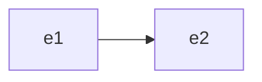

Fuer zwei Ereignisse $e_1$ und $e_2$ mit $e_1 \leq_0 e_2$ benutzt man die Darstellung

Ein Ereignisdiagramm für eine Relation $\leq_0$, die auf [Ereignissen](Ereignis.md) definiert ist, stellt alle Elemente von $\leq_0$ durch die obige Pfeilnotation dar.

Jedes Ereignis kommt in dem Diagramm nur einmal vor.
In Aktionsdiagrammen kann eine Aktion mehrmals vorkommen.