> Jannis Lauterbach, Gregor Stöbener, Kilian Lichtner

## Aufgabe 1

### a)
Jede Kante in einem ungerichteten Graphen mit n Knoten kann entweder vorhanden oder nicht vorhanden sein. Da es n Knoten gibt und jede Kante zwischen zwei Knoten besteht, gibt es insgesamt $n(n-1)/2$ mögliche Kanten. Da jede dieser Kanten entweder vorhanden oder nicht vorhanden sein kann, gibt es $2^{\left(n\atop 2\right)}$ mögliche Kombinationen von Kanten, die zu unterschiedlichen ungerichteten Graphen führen.

### b)

---
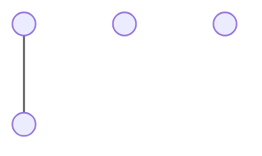
---
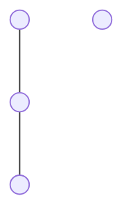
---

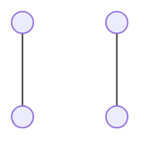
---

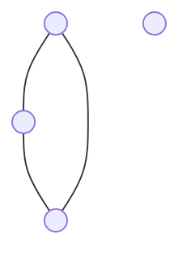
---

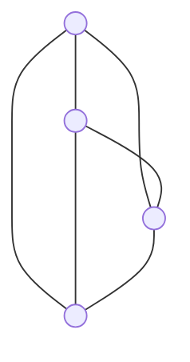
---

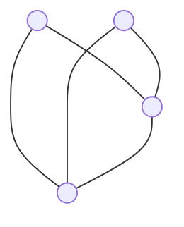

---

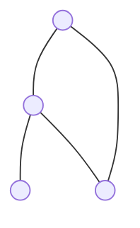
---

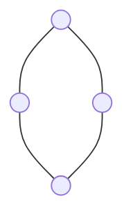
---
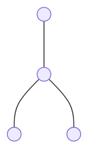
---

---
Es gibt insgesamt $2^{\left(4\atop 2\right)}$ also $64$ unterschiedliche Graphen und 11 Isomorphie Klassen.

## Aufgabe 2
#### a)
Die beiden Graphen sind isomorph. 

$\varphi$ : 
1 $\mapsto$ 1
2 $\mapsto$ 3
3 $\mapsto$ 2

### b)
Angenommen wir haben zwei Graphen $G$ und  $H$. Falls es eine bijektive Funktion $f:V(G)\to V(H)$ gibt, welche die benachbarten Vertices von $G$ auf die benachbarten Vertices auf $H$ abbildet, ist die Menge der Knoten und Kanten von $G$ und $h$ gleich. Somit liegen die Graphen auf einer Bahn. Die Graphen wären ab diesem Punkt schon isomorph. Allerdings wissen wir nicht die richtige Anordnung der Knoten zueinander, die richtige Anordnung muss mithilfe der Permutationen herausgefunden werden. Dabei müssen alle Permutationen ausprobiert werden bis eine passenden gefunden ist.

## Aufgabe 3

1.  Identität: 

Der Stabilisator ist die identische Gruppe $S_3$.

2.  (1 2)

   Der Stabilisator ist die Gruppe der geraden Permutationen $S_3(e)$.

3.  (1 3): 
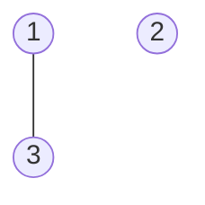
Der Stabilisator ist die Gruppe der geraden Permutationen $S_3(e)$.

4.  (2 3)
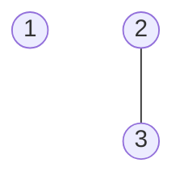
Der Stabilisator ist die Gruppe der geraden Permutationen $S_3(e)$.

5.  (1 2 3):

   Der Stabilisator ist die triviale Gruppe {e}.

6.  (1 3 2): 

   Der Stabilisator ist die Gruppe der ungeraden Permutationen $S_3(o)$.

### b)

Die Graphen sind paarweise nicht isomorph. Man kann zeigen, dass sie ein
vollständiges Repräsentantensystem der Graphen mit 3 Vertices
bilden: 
Sei $V = {1, 2, 3}$ und sei M die Menge der Graphen mit Vertexmenge $V$ , also
$|M|=2^{\left(3 \atop 2 \right)} = 2^3 = 8$.

Die Gruppe $G = S_3$ operiert auf $M$ durch Permutation der Verti-
ces. Wir geben für jeden der obigen Graphen $m$ den Isomorphie-
typ des Stabilisators und mit Hilfe der Bahnenformel die Länge
der Bahn an.

Wenn man nun alle Bahnen zusammen rechnet hat man:
$8 = 1 + 3 + 3 + 1$
Elemente. Somit bilden die vier angegebenen Graphen ein voll-
ständiges Repräsentantensystem der Bahnen der Operation von
$G$ auf $M$. Weiter sind die Bahnen genau die Isomorphieklassen.

## Aufgabe 4

### a)

### b)
| $+$  |  $0$ | $1$ | $2$  |  $3$ |  $4$ |  $5$ |  $6$ |  $7$ |  $8$ | $9$ |
|---|---|---|---|---|---|---|---|---|---|---|
| $0$  | $0$  |  $1$ |  $2$ | $3$  | $4$  | $5$  |  $6$ | $7$  |  $8$ |  $9$ |
|  $1$ |  $1$ | $2$  |  $3$ | $4$  | $5$  | $6$  | $7$  |  $8$ | $9$  | $0$  |
|  $2$ |  $2$ | $3$  |  $4$ | $5$  |  $6$ |  $7$ |  $8$ | $9$  | $0$  |  $1$ |
| $3$  | $3$  | $4$  | $5$  | $6$  | $7$  |  $8$ | $9$  | $0$  | $1$  | $2$  |
|  $4$ | $4$  |  $5$ | $6$  |  $7$ |  $8$ | $9$  | $0$  | $1$  | $2$  | $3$  |
| $5$  |$5$ | $6$  |  $7$ |  $8$ | $9$  | $0$  | $1$  | $2$  | $3$  | $4$ |
| $6$  | $6$  |  $7$ |  $8$ | $9$  | $0$  | $1$  | $2$  | $3$  | $4$ | 5|
| $7$  |$7$ |  $8$ | $9$  | $0$  | $1$  | $2$  | $3$  | $4$ | 5|$6$|
|  $8$ | $8$ | $9$  | $0$  | $1$  | $2$  | $3$  | $4$ | 5|$6$|$7$|
| $9$  |$9$  | $0$  | $1$  | $2$  | $3$  | $4$ | 5|$6$|$7$|$8$|

| $\cdot$  | $0$  | $1$  |  $2$ | $3$  |  $4$ |  $5$ |  $6$ | $7$  |  $8$ |  $9$ |
|---|---|---|---|---|---|---|---|---|---|---|
| $0$  | $0$  | $0$  |  $0$ | $0$  | $0$  |  $0$ |  $0$ | $0$  | $0$  |  $0$ |
|  $1$ | $0$  | $1$  | $2$  | $3$  | $4$  |  $5$ |  $6$ | $7$  |  $8$ | $9$  |
|  $2$ |  $0$ | $2$  | $4$  |  $6$ |  $8$ | $0$  | $2$  | $4$  |  $6$ | $8$  |
| $3$  |  $0$ | $3$  | $6$  | $9$  | $2$  | $5$  |  $8$ |  $1$ | $4$  | $7$  |
|  $4$ | $0$  | $4$  | $8$  | $2$  | $6$  |  $0$ | $4$  | $8$  | $2$  | $6$  |
|  $5$ |  $0$ | $5$  | $0$  | $5$  | $0$  |  $5$ | $0$  |  $5$ |  $0$ |  $5$ |
| $6$  | $0$  |  $6$ |  $2$ |  $8$ |  $4$ | $0$  |  $6$ |  $2$ | $8$  | $4$  |
|  $7$ |  $0$ |  $7$ |  $4$ | $1$  | $8$  |  $5$ | $2$  | $9$  |  $6$ | $3$  |
|  $8$ | $0$  | $8$  | $6$  |  $4$ | $2$  | $0$  | $8$  | $6$  | $4$  |  $2$ |
|  $9$ | $0$  |  $9$ |  $8$ | $7$  |  $6$ | $5$  | $4$  |  $3$ | 2  | 1  |

Diese Elemente haben multiplikative Inverse: $\{1, 3, 7, 9\}$

__Assoziativ__: Die Multiplikation ist assoziativ.
__Neutral element__: $1$ ist das neutral Element der Multiplikation
__Inverse__:  $1$ ist zu sich selbst inverse, $3$ ist inverse zu $7$ und $9$ ist zu sich selbst invers
$$\begin{align}
&a\circ a^{-1} = e\\
\\
&1 \cdot 1 \mod 10 = 1\\
&3 \cdot 7 \mod 10 = 1\\
&9 \cdot 9 \mod 10 = 1
\end{align}$$

