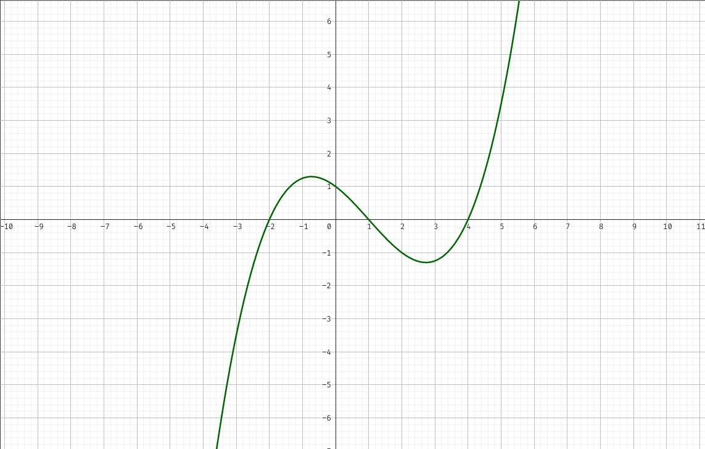

## Aufgabe 1

$$f = x_{1} t^{3} + x_{2}t^{2} + x_{3}t +x_{4}$$

$$\begin{matrix}
&x_1(-2)^3 &+ &x_2(-2)^2 &+ &x_3(-2) &+ &x_4 (-2) &= &0 \\
&x_1 0^3 &+ &x_2 0^2 &+ &x_3 0 &+ &x_4 0 &= &y \\
&x_1 1^3 &+ &x_2 1^2 &+ &x_3 1 &+ &x_4 1 &= &0 \\
&x_1 4^3 &+ &x_2 4^2 &+ &x_3 4 &+ &x_4 4 &= &0 \\
\end{matrix}$$
$$\left( \begin{array}{@{}cccc|c@{}} -8 & 4 & -2 & 1 & 0\\ 0 & 0 & 0 & 0 & y\\ 1 & 1 & 1 & 1 & 0\\ 64 & 16 & 4 & 1 & 0\\ \end{array}\right)$$ $$\left( \begin{array}{@{}cccc|c@{}} -8 & 4 & -2 & 1 & 0\\ 0 & 0 & 0 & 0 & y\\ 0 & \frac{3}{2} & \frac{3}{4} & \frac{9}{8} & 0\\ 64 & 16 & 4 & 1 & 0\\ \end{array}\right)$$ $$\left( \begin{array}{@{}cccc|c@{}} -8 & 4 & -2 & 1 & 0\\ 0 & 0 & 0 & 0 & y\\ 0 & \frac{3}{2} & \frac{3}{4} & \frac{9}{8} & 0\\ 0 & 48 & -12 & 9 & 0\\ \end{array}\right)$$ $$\left( \begin{array}{@{}cccc|c@{}} -8 & 4 & -2 & 1 & 0\\ 0 & \frac{3}{2} & \frac{3}{4} & \frac{9}{8} & 0\\ 0 & 0 & 0 & 0 & y\\ 0 & 48 & -12 & 9 & 0\\ \end{array}\right)$$ $$\left( \begin{array}{@{}cccc|c@{}} -8 & 4 & -2 & 1 & 0\\ 0 & \frac{3}{2} & \frac{3}{4} & \frac{9}{8} & 0\\ 0 & 0 & 0 & 0 & y\\ 0 & 0 & -36 & -27 & 0\\ \end{array}\right)$$ $$\left( \begin{array}{@{}cccc|c@{}} -8 & 4 & -2 & 1 & 0\\ 0 & \frac{3}{2} & \frac{3}{4} & \frac{9}{8} & 0\\ 0 & 0 & -36 & -27 & y\\ 0 & 0 & 0 & 0 & 0\\ \end{array}\right)$$

$y\neq 0$
$$\left( \begin{array}{@{}cccc|c@{}} 
-8 & 4 & -2 & 1 & 0\\
0 & \frac{3}{2} & \frac{3}{4} & \frac{9}{8} & 0\\
0 & 0 & -36 & -27 & 0\\ 
0 & 0 & 0 & 0 & y\\
\end{array}\right)$$
$y = 0$
$$\left( \begin{array}{@{}cccc|c@{}} 
-8 & 4 & -2 & 1 & 0\\
0 & \frac{3}{2} & \frac{3}{4} & \frac{9}{8} & 0\\
0 & 0 & -36 & -27 & 0\\ 
0 & 0 & 0 & 0 & 0\\
\end{array}\right)$$

$$\begin{align}
-36x_3=27x_4 \\
x_3=\frac{-3}{4}\cdot x_4
\end{align}$$
$$\begin{align}
\frac{3}{2}\cdot x_2 = \frac{-3}{4} \cdot x_3 - \frac{9}{8}\cdot x_4 = \frac{-3}{4} \cdot (\frac{-3}{4}\cdot 4) - \frac{9}{8} \cdot x_4 = \frac{-9}{16} \cdot x_4 \\
x_2 = \frac{-3}{8} \cdot x_4
\end{align}$$
$$\begin{align}
-8x_1=-4x_2 + 2x_3 -x_4 = -4\cdot (\frac{-3}{8}\cdot x_4)+2 \cdot (\frac{-3}{4}\cdot x_4)- x_4 = -x_4 \\
x_1 = \frac{1}{8}\cdot x_4
\end{align}$$

Ergebnis:
$x_1 = \frac{1}{8}\cdot x_4  \qquad (y=0)$
$x_2 = \frac{-3}{8} \cdot x_4$
$x_3 = \frac{-3}{4} \cdot x_4$
$x_4 = x_4$

## Aufgabe 2

### a)
$\left( \begin{array}{@{}ccccc|c@{}} 1 & 2 & 2 & -2 & -1 & 0 \\ -2 & -3 & -1 & 8 & 1 & 0 \\ 1 & 4 & 8 & 8 & -4 & 0 \\ 2 & 5 & 7 & 2 & -4 & 0\end{array}\right)$

$\left( \begin{array}{@{}ccccc|c@{}} 1 & 2 & 2 & -2 & -1 & 0 \\ 0 & 1 & 3 & 4 & -1 & 0 \\ 0 & 2 & 6 & 10 & -1 & 0 \\ 0 & 1 & 3 & 6 & -2 & 0\end{array}\right)$

$\left( \begin{array}{@{}ccccc|c@{}} 1 & 2 & 2 & -2 & -1 & 0 \\ 0 & 1 & 3 & 4 & -1 & 0 \\ 0 & 0 & 0 & 2 & -1 & 0 \\ 0 & 0 & 0 & 2 & -1 & 0\end{array}\right)$

$\left( \begin{array}{@{}ccccc|c@{}} 1 & 2 & 2 & -2 & -1 & 0 \\ 0 & 1 & 3 & 4 & -1 & 0 \\ 0 & 0 & 0 & 2 & -1 & 0 \\ 0 & 0 & 0 & 0 & 0 & 0\end{array}\right)$

### b)
Gauß-Jordan Verfahren:

$\left( \begin{array}{@{}ccccc|c@{}} 1 & 2 & 2 & -2 & -1 & 0 \\ -2 & -3 & -1 & 8 & 1 & 0 \\ 1 & 4 & 8 & 8 & -4 & 0 \\ 2 & 5 & 7 & 2 & -4 & 0\end{array}\right)$

$\left( \begin{array}{@{}ccccc|c@{}} 1 & 2 & 2 & -2 & -1 & 0 \\ 0 & 1 & 3 & 4 & -1 & 0 \\ 0 & 2 & 6 & 10 & -3 & 0 \\ 0 & 1 & 3 & 6 & -2 & 0\end{array}\right)$

$\left( \begin{array}{@{}ccccc|c@{}} 1 & 2 & 2 & -2 & -1 & 0 \\ 0 & 1 & 3 & 4 & -1 & 0 \\ 0 & 0 & 0 & 1 & - 1\over2 & 0 \\ 0 & 0 & 0 & 2 & -1 & 0\end{array}\right)$

$\left( \begin{array}{@{}ccccc|c@{}} 1 & 2 & 2 & 0 & -2 & 0 \\ 0 & 1 & 3 & 0 & 1 & 0 \\ 0 & 0 & 0 & 1 & - 1\over2 & 0 \\ 0 & 0 & 0 & 0 & 0 & 0\end{array}\right)$

$\left( \begin{array}{@{}ccccc|c@{}} 1 & 0 & -4 & 0 & -4 & 0 \\ 0 & 1 & 3 & 0 & 1 & 0 \\ 0 & 0 & 0 & 1 & - 1\over2 & 0 \\ 0 & 0 & 0 & 0 & 0 & 0\end{array}\right)$
### c)
$V=\lbrace (4x_3 + 4x_5, -3x_3 - x_5,x_3,{1\over2} \cdot x_5,x_5) \  | x_3, x_5 \in \mathbb R \rbrace$

## Aufgabe 3

$$\begin{align*}
-x_{1} &+& x_{2} &-& 2x_{3} &= 0\\
x_{1} &+& (t-1) \cdot x_{2} &+& 2x_{3} &= 0\\
2x_{1} &+& (t-2) \cdot x_{2} &+& (t^{2} - t + 4) \cdot x_{3}&= 0
\end{align*}$$
$$\begin{align*}
\left(
\begin{array}{@{}ccc|c@{}}
-1 & 1 & -2 & 0 \\
1 & t-1 & 2 &0 \\
2 & t-2& t^2-t+4& 0
\end{array}\right)\\\\

\left(\begin{array}{@{}ccc|c@{}}
-1 & 1 & -2 & 0 \\
0 & t & 0 &0 \\
0 & t& t^2-t& 0
\end{array}\right)\\\\

\left(\begin{array}{@{}ccc|c@{}}
-1 & 1 & -2 & 0 \\
0 & t & 0 &0 \\
0 & 0& t^2-t& 0
\end{array}\right)
\end{align*}$$
$$\begin{align*}
&I: -x_{1} &+& x_{2} &-& 2x_{3} &= 0\\
&II:&& t\cdot x_{2} &&&= 0\\
&III: &&&& (t^{2} -t) \cdot x_{3}  &= 0
\end{align*}$$

$$\begin{align*}
II:& t \cdot x_{2}&= 0\\
&x_{2} &= \frac{0}{t}\qquad t\not =  0\\\\
\end{align*}$$
$$\begin{align*}
III:& (t^{2}- t) \cdot x_{3}= 0\\
&x_{3}= \frac{0}{t^{2}-t} \qquad t\not=1 \land t\not= 0
\end{align*}$$

Wenn $t=1$ 
$$
V = \left\lbrace\left(\begin{array}{}-2x_{3}\\0\\x_{3}\end{array}\right)\right\rbrace
$$
Wenn $t = 0$
$$
V =\left\lbrace\left(\begin{array}{}0\\x_2\\x_3\end{array}\right)\right\rbrace
$$
Sonst:
$$
V = \left\lbrace\left(\begin{array}{}0\\0\\0\end{array}\right)\right\rbrace
$$

## Aufgabe 4

### a)

### b)

$$\begin{align*}
x_{1}+2x_{2} + x_{3} + 5x_{4} &= 0\\
x_{3} + 5x_{4}&= 0\\
\end{align*}$$

$$
x_{3}= -5x_{4}
$$

$$\begin{align*}
x_{1}+2x_{2} + x_{3} + 5x_{4} &= 0 | x_{3}= -5x_4\\
x_{1}+2x_{2} -5x_{4} + 5x_{4} &= 0\\
x_{1}+2x_{2} &= 0\\
x_{1}&= -2x_{2}
\end{align*}$$

$$V = \left\lbrace
\left(
\begin{array}{}
-2x_2\\
x_2\\
-5x_{4}\\
x_4
\end{array}
\right)|x_{2}, x_{4}\in \mathbb Q\right\rbrace = \left\lbrace\left(
\begin{array}{}
-2\\ 0 \\ -5\\ 0
\end{array}
\right) + x_{2}\cdot \left(
\begin{array}{}
1\\1\\0\\0
\end{array}
\right) + x_{4}\cdot \left(
\begin{array}{}
0\\0\\1\\1
\end{array}
\right)|x_{2}, x_{4}\in \mathbb Q\right\rbrace
$$

$(x_{2},x_{4}) = (1, 0) \land (x_{2}, x_{4}) = (0, 1)$ Ergibt die Basis

$$V = \left\langle
\left(
\begin{array}{}
-2\\1\\0\\0
\end{array}
\right),
\left(
\begin{array}{}
0\\0\\-5\\1
\end{array}
\right)
\right\rangle$$

Jedes Element von $V$ lässt sich als eindeutige Linearkombination darstellen:

$$
\left(
\begin{array}{}
-2x_2\\
x_2\\
-5x_{4}\\
x_4
\end{array}
\right) = x_2\cdot\left(
\begin{array}{}
-2\\1\\0\\0
\end{array}
\right) + x_{4}\cdot\left(
\begin{array}{}
0\\0\\-5\\1
\end{array}
\right)
$$
und die Vektoren sind linear unabhaengig.

